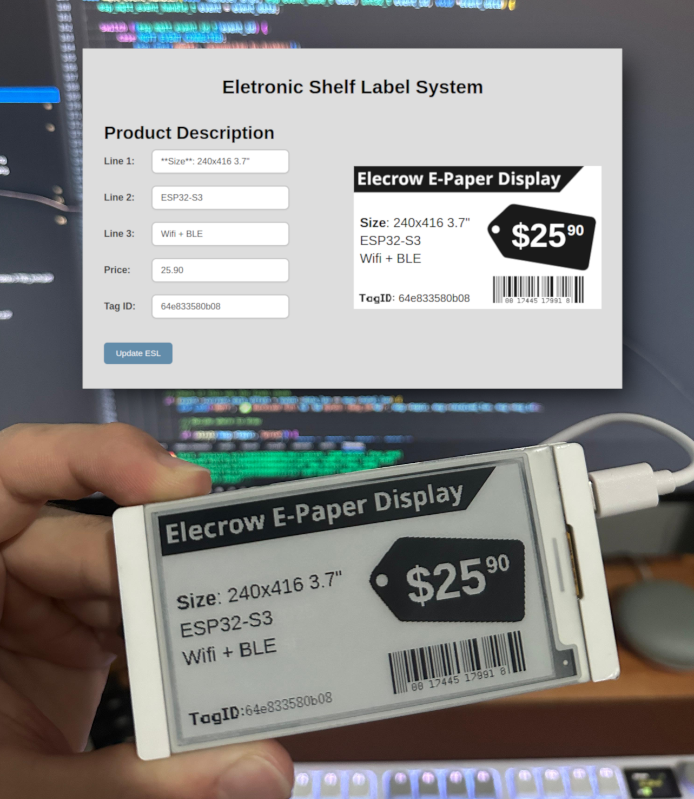
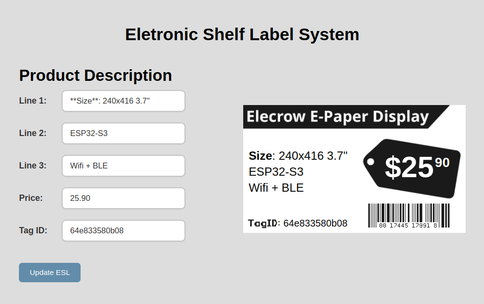
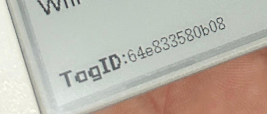

# ESP32 E-Paper ESL (Electronic Shelf Label) System

This is a basic ESL system that consists of:

- ESP32-S3 E-Paper display board from Elecrow
- Web server for ESL management



## Building and Running the Web Server

You need to have Docker and Docker Compose installed.

The provided **Dockerfile** builds an image with a web app for ESL management and an MQTT broker.

- Go into the `web-server` folder.

- Edit file `web-server/web-page/js/script.js`, and chose your MQTT broker
```
const MQTT_BROKER = "ws://localhost:9001";
// const MQTT_BROKER = "ws://broker.emqx.io:8083/mqtt";
```

> 💡 You can also use a public broker

- Run docker compose to build and start the container
```
docker compose up -d
```

- Open browser on `localhost` to access ESL Management System web page.



If you make any changes to the web page code or the web-server folder, don’t forget to restart the container:
```
docker compose restart
```

## Building ESP32 with ESP-IDF

You need the ESP-IDF VSCode Extension installed and ESP-IDF v5.x.

To connect your board to Wi-Fi and the MQTT broker, create a `.env` file in the root folder with content like below:
```
WIFI_SSID="YourSSID"
WIFI_PASSWORD="YourPassword"
MQTT_BROKER="mqtt://192.168.0.15"
```

> ℹ️ The `MQTT_BROKER` IP should be the address of the machine running the container or the public broker of your choice.

- Lastly build and flash the firmware on ESP32 using ESP-IDF VSCode extension shortcuts.

## Put it to action!

If all goes well you should see ESP32 connect to Wi-Fi, get an IP address, connect to broker and setup the display.
```
I (429) MAIN: Initializing ESL E-Paper Display...
I (429) WIFI: SSID: <your wifi ssid appears here>
I (429) WIFI: PASS: <your wifi password appears here>
I (439) WIFI: BROKER: mqtt://192.168.0.15
I (459) WIFI: Initializing Wi-Fi...
I (609) wifi:mode : sta (64:e8:33:58:0b:08)
I (3389) WIFI: Got IP: 192.168.0.225
I (3389) WIFI: Gateway: 192.168.0.1
I (3389) WIFI: Connected to Wi-Fi
I (3399) NETIF: Got IP: 192.168.0.225
I (3399) NETIF: Gateway: 192.168.0.1
I (3399) NETIF: Netmask: 255.255.255.0
I (3419) EPD: Resetting UC8253 ePaper...
I (3449) MQTT: Connected to broker
I (3459) EPD: Clearing Display...
I (4979) EPD: Display Cleared
I (12699) MAIN: UC8253 EPD Initialized and Cleared.
```

- The display will show its MAC address at the bottom.


- On the Web page type in the information like product description, price and most importantly the tag id.
```
TagID: 64e833580b08
```

- Click `Update ESL` button to send information to the e-paper display.

- You can open Chrome console (F12), to check logs.
```
✅ Exported description area: 215x92
✅ Exported price area: 121x58
✅ MQTT connected!
Sending description (2580 bytes) to esl/64e833580b08/description
Sending price (968 bytes) to esl/64e833580b08/price
```

- On ESP32 terminal you should see the bytes comming in.
```
I (566029) MQTT: 📥 Start receiving esl/64e833580b08/description (2580 bytes) [msg_id=0]
I (566039) MQTT: ✅ Received full esl/64e833580b08/description (2580 bytes) [msg_id=0]
I (566049) MQTT: 📥 Start receiving esl/64e833580b08/price (968 bytes) [msg_id=0]
I (566049) MQTT: ✅ Received full esl/64e833580b08/price (968 bytes) [msg_id=0]
I (566059) EPD: Resetting UC8253 ePaper...
```

And the display finally updates!

> If you want to generate images to work with the code in this repo and display, use [Image2LCD](https://www.e-paper-display.com/Image2LCD.html) and **vertical scan**.